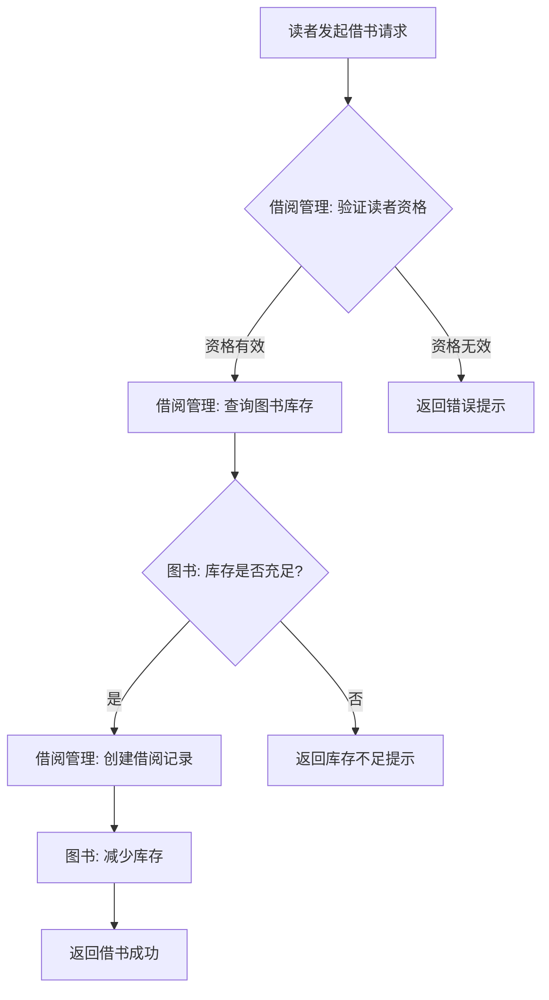

```mermaid
flowchart TD
    A[读者发起借书请求] --> B{借阅管理: 验证读者资格}
    B -->|资格有效| C[借阅管理: 查询图书库存]
    B -->|资格无效| D[返回错误提示]
    C --> E{图书: 库存是否充足?}
    E -->|是| F[借阅管理: 创建借阅记录]
    F --> G[图书: 减少库存]
    G --> H[返回借书成功]
    E -->|否| I[返回库存不足提示]
```
